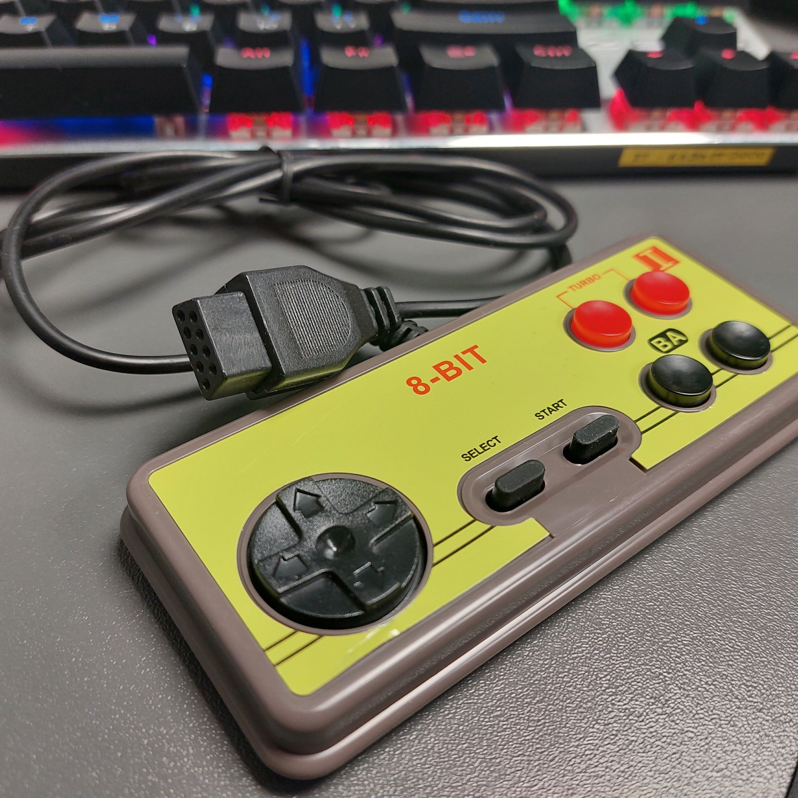
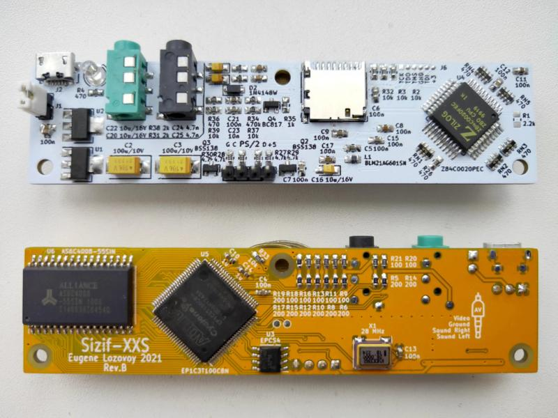
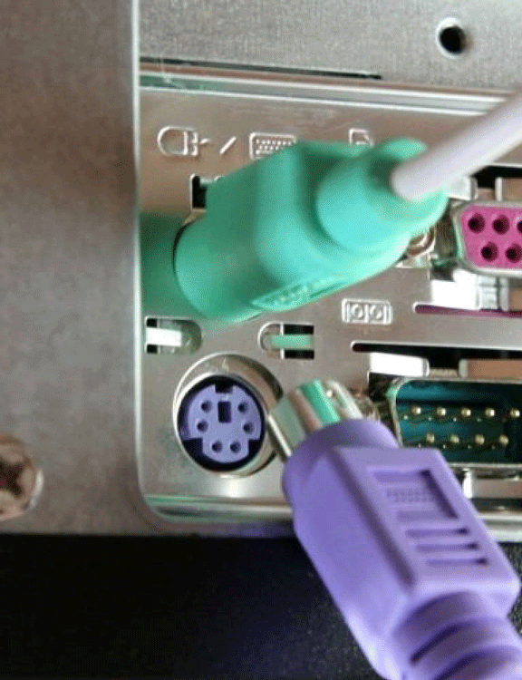

# NES gamepads via PS2 interface
Connecting 8-bit NES gamepads to retrocomputer emulators or old PC via the PS2 interface

  

## Motivation
There are a number of good old ZX Spectrum emulator projects on the network, for example: **[Sizif XXS](https://github.com/UzixLS/zx-sizif-xxs)**. In addition, some older computers and laptops contain a PS/2 slot, but do not have the ability to connect a gamepad. The available solutions that I managed to find are either sold for money, or do not work. Therefore, it was decided to make a simple and cheap device for connecting two gamepads and PS/2 keyboard to one input of the PS/2 retro computer.

## Components
The following purchased components will be needed to assemble the device:
- Sizif XXS RevB as emulator (optional - all 3D models were designed for it) ([`Image1`](/images/sizif-xxs-revB.jpg))
- Arduino Nano V3.0 CH340 USB TYPE-C ([`Image1`](/images/Arduino-Nano-V3_0-CH340-USB_TYPE-C.png))
- PS2 MDC/S Terminal Mini Socket ([`Image1`](/images/PC2-MDC-S1.png), [`Image2`](/images/PC2-MDC-S2.png))
- 90 Degree 9 Pin Female Slot Connector Socket for Sega 2 Generation ([`Image1`](/images/Sega-slot.png))
- YZWM 10mm Metal Button Switch Self-locking Switch 2a, 250V ([`Image1`](/images/Metal-Button-Switch.png), [`Image2`](/images/Metal-Button-Switch2.png))
- Screw M2.5x6mm - 7 pcs ([`Image1`](/images/M2_5x6mm.png))
- Screw M2.5x14mm - 2 pcs ([`Image1`](/images/M2_5x14mm.png))
- Nut M2.5 - 2 pcs ([`Image1`](/images/Nut-M2_5.png))

For 3D modeling, I used SolidWorks. All models can be found in the 3D models directory.\
After assembling and testing the device I will complete the stl files for printing.\
To print parts from PLA plastic, you will need an FDM 3D printer. All models are optimized for 0.4mm nozzle and 0.2mm layer thickness.

## TODO list
- [X] Create TODO list
- [X] 3D Case model for Sizif XXS
- [X] Collect needed components and write description
- [ ] Buy all components to refine models
- [ ] Create Wire Diagram
- [ ] Rebuild Case model for Sizif XXS and all components
- [ ] Code MVP with hardcoded keys
- [ ] Assemble the device
- [ ] Test for two NES Gamepads
- [ ] Add Configuration using NumLock key
- [ ] Create Video Guide
- [ ] Enjoy local multiplayer Games on Sizif XXS

## References
### Ideas
- Project from Volo: Volo's Gamepad to PS/2 Adapter [`Video`](https://www.youtube.com/watch?v=FsssOJsSnDY)
- Project from GameStar: Dynapoint GameStar: 1993 NES to PC Keyboard Adapter [`Video`](https://youtu.be/Ko1SEP-VtGs?si=I_s7tsCCiQifjQXr)

### Arduino Projects
- NES Controller Interface with an Arduino UNO - Projects [`Page`](https://www.allaboutcircuits.com/projects/nes-controller-interface-with-an-arduino-uno/)
- Arduino ps2dev library [`code`](https://github.com/Harvie/ps2dev)
