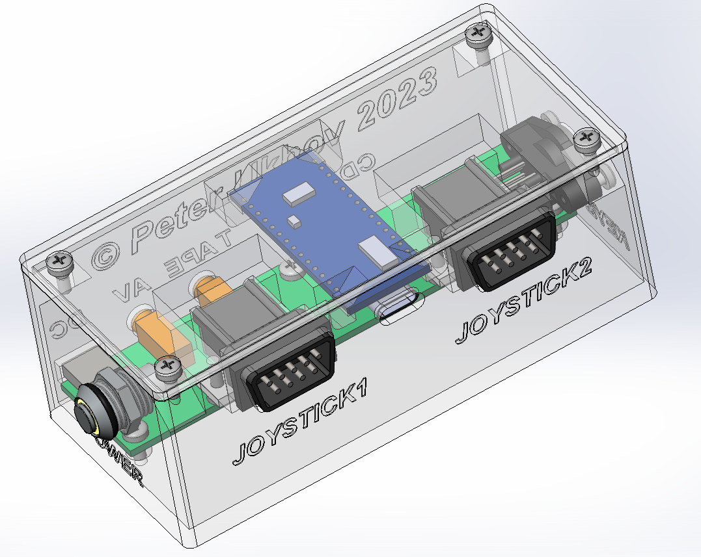
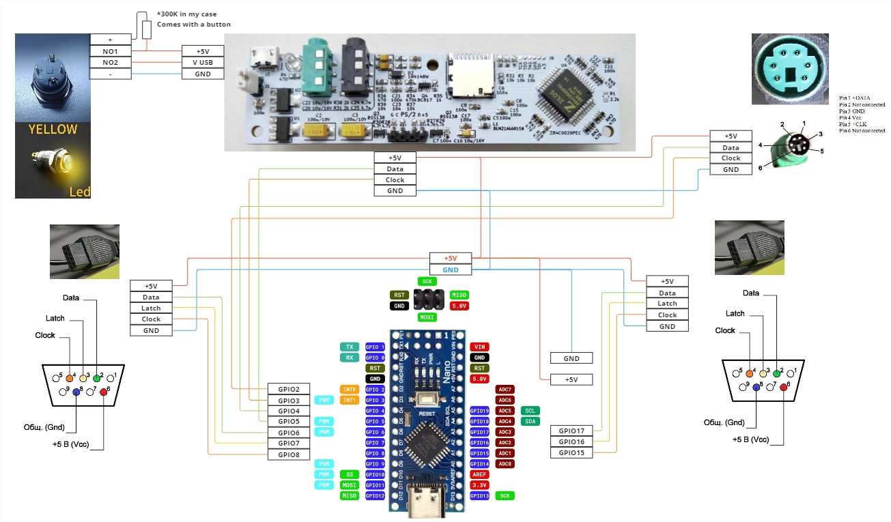
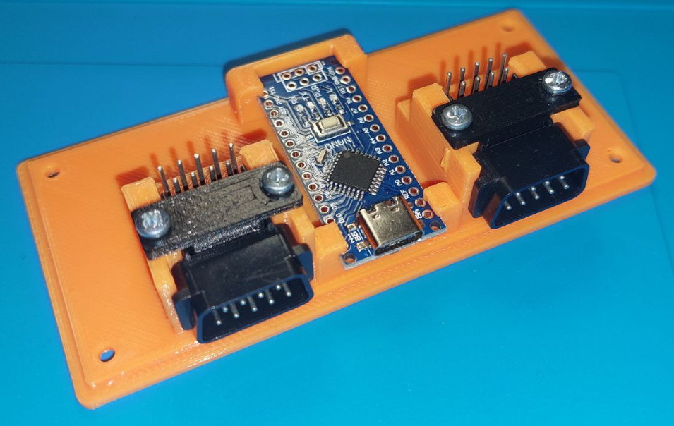
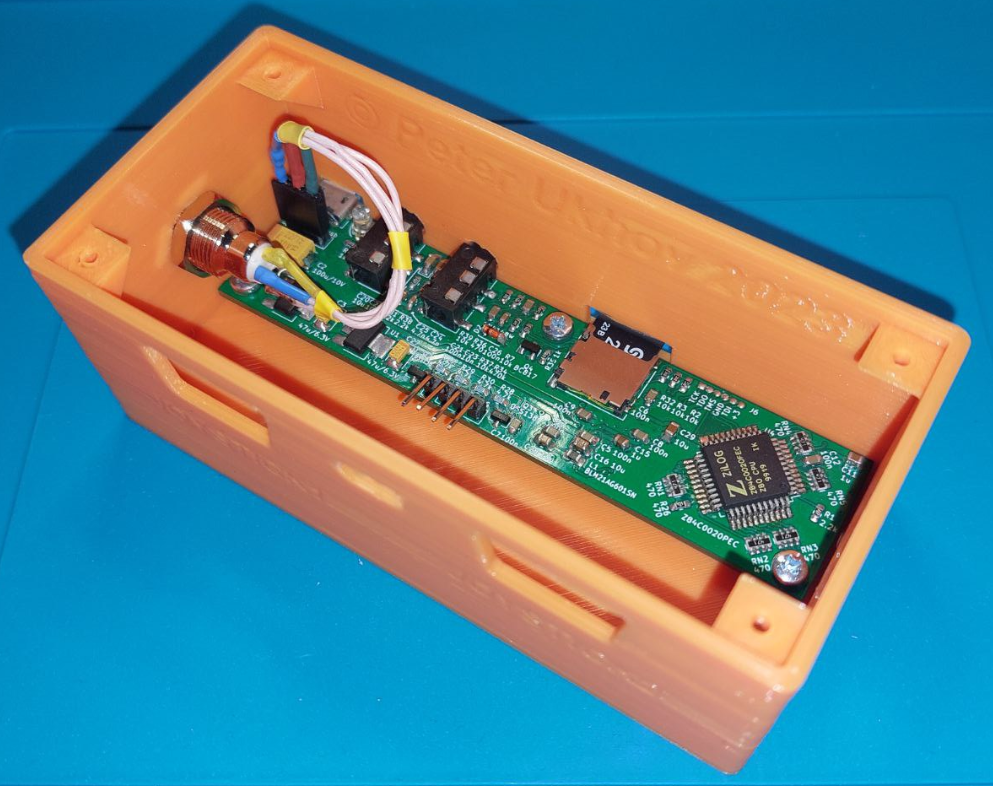
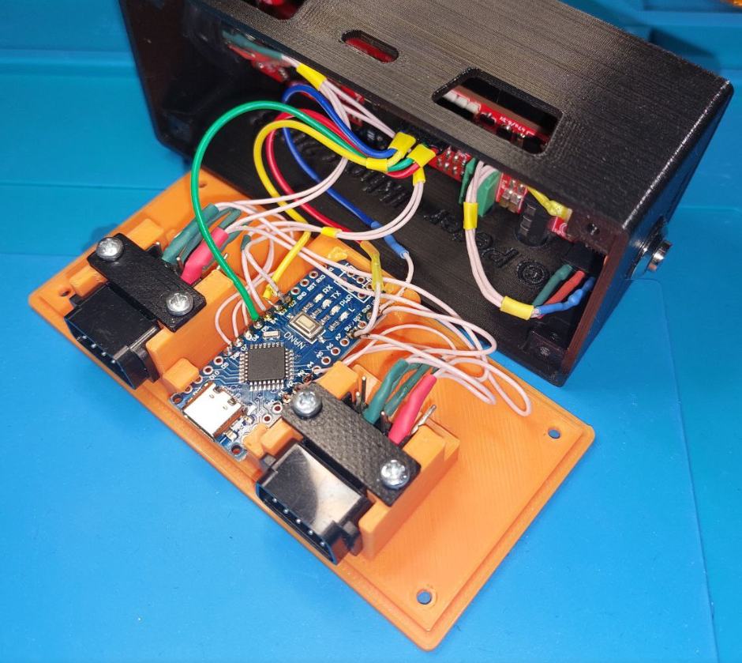
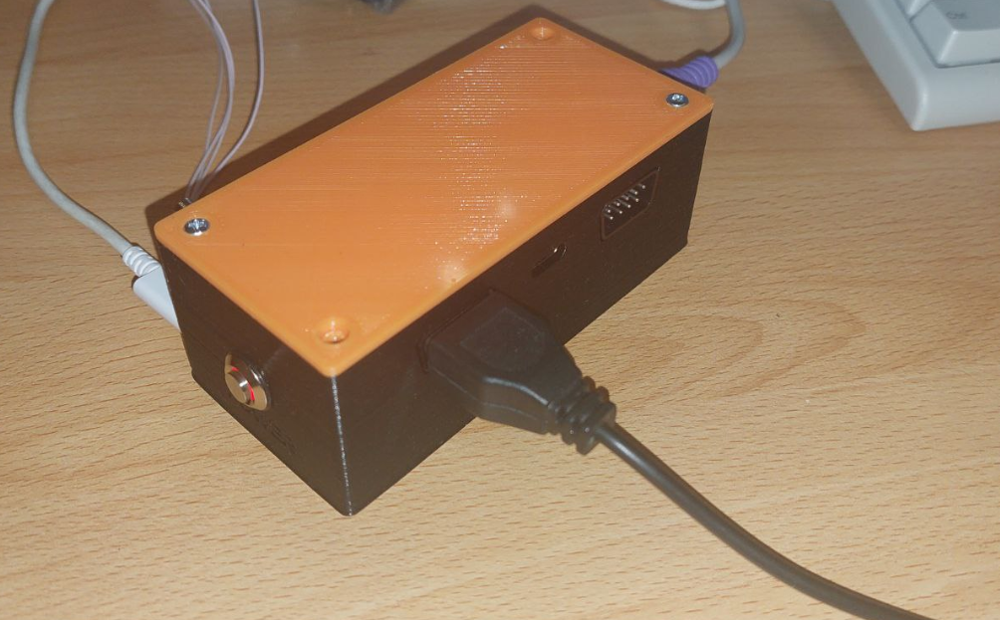

# NES gamepads via PS2 interface
Connecting 8-bit NES gamepads to retrocomputer emulators or old PC via the PS2 interface

  

## Motivation
There are a number of good old ZX Spectrum emulator projects on the network, for example: **[Sizif XXS](https://github.com/UzixLS/zx-sizif-xxs)**. In addition, some older computers and laptops contain a PS/2 slot, but do not have the ability to connect a gamepad. The available solutions that I managed to find are either sold for money, or do not work. Therefore, it was decided to make a simple and cheap device for connecting two gamepads and PS/2 keyboard to one input of the PS/2 retro computer.

## Components
Retro PC emulator:
- Sizif XXS RevB as emulator (optional - all 3D models were designed for it) ([`Image1`](/images/sizif-xxs-revB.jpg))
- PS/2 Keyboard
- Video Cable (Jack 3.5: 1-AudioLeft, 2-AudioRight, 3-GND, 4-Video)
- 2 NES Gamepads from Sega 9pin ;)

The following purchased components will be needed to assemble the device:
- Arduino Nano V3.0 CH340 USB TYPE-C ([`Image1`](/images/Arduino-Nano-V3_0-CH340-USB_TYPE-C.png))
- PS2 MDC/S Terminal Mini Socket ([`Image1`](/images/PC2-MDC-S1.png), [`Image2`](/images/PC2-MDC-S2.png))
- Sega MD2 9Pin 90Degree Female Socket Connector ([`Image1`](/images/Sega-slot.png)), ([`Image2`](/images/Sega-slot2.png))
- 10mm Metal Button Switch Self-locking with LED 3-6V ([`Image1`](/images/Metal-Button-Switch.png), [`Image2`](/images/Metal-Button-Switch2.png))
- Screw M2.5x6mm - 13 pcs ([`Image1`](/images/M2_5x6mm.png))

For 3D modeling, I used SolidWorks. All models can be found in the 3D models directory.\
After assembling and testing the device I will complete the stl files for printing.\
To print parts from PLA plastic, you will need an FDM 3D printer. All models are optimized for 0.4mm nozzle and 0.2mm layer thickness.

Case for Sizif XXS RevB looks like here:\

## Wire Diagram

Gamepads Arduino pins:
- PULT1_DATA_PIN 17
- PULT1_LATCH_PIN 16
- PULT1_CLOCK_PIN 15
- PULT2_DATA_PIN 6
- PULT2_LATCH_PIN 7
- PULT2_CLOCK_PIN 8

Emulator Arduino pins to connect into retro PC
- SIZIF_KEYBOARD_DATA_PIN 5
- SIZIF_KEYBOARD_CLOCK_PIN 3

PS2 Keyboard Arduino pins to connect into Keyboard
- PS2_KEYBOARD_DATA_PIN 4
- PS2_KEYBOARD_CLOCK_PIN 2

For other NES sockets:

## Assembly instructions
First assemble the cover with the NES connectors:

Attach Sizif XXS to the case. Solder connector and resistor to the power button:

Solder the wires to the NES connectors, Sizif XXS board connector and PS/2 keyboard connector:

Connect all connectors and close the device case:

During debugging, this bug appeared on one SizifXXS board:

The issue is most likely caused by an unstable power supply.
A capacitor with a larger capacity is installed on the second board and there was no problem.

## MVP demo
You can already play!

But there are still bugs with repeated keystrokes.
There is no handling of simultaneous pressing of several keys.
Needs improvement.

An example for a simple game where the Gamepad already works well ;)

Game: [`Earth Shaker`](https://viva-games.ru/game/earth-shaker)

## TODO list
- [X] Create TODO list
- [X] 3D Case model for Sizif XXS
- [X] Collect needed components and write description
- [X] Buy all components to refine models
- [X] Create Wire Diagram
- [X] 3D Printing and Assembly Test
- [X] Final Rebuild Case model for Sizif XXS and all components
- [X] Assemble the device
- [X] Write about power bug
- [X] Code and test Keyboard repiter
- [X] Code MVP with hardcoded keys
- [X] Test for two NES Gamepads
- [X] Rewrite source code to eliminate key-repeat bugs
- [ ] Add NES class with buffer
- [ ] Rewrite code for keyboard libs (not optimal, it should be one lib)
- [X] Add good key handling for NES Joystick (simultaneous pressing)
- [ ] Add Configuration using NumLock key and EEPROM
- [ ] Create Video Guide
- [X] Enjoy local multiplayer Games on Sizif XXS

## References
### Ideas
- Project from Volo: Volo's Gamepad to PS/2 Adapter [`Video`](https://www.youtube.com/watch?v=FsssOJsSnDY)
- Project from GameStar: Dynapoint GameStar: 1993 NES to PC Keyboard Adapter [`Video`](https://youtu.be/Ko1SEP-VtGs?si=I_s7tsCCiQifjQXr)

### Arduino Projects
- NES Controller Interface with an Arduino UNO - Projects [`Page`](https://www.allaboutcircuits.com/projects/nes-controller-interface-with-an-arduino-uno/)
- Arduino ps2dev library [`code`](https://github.com/Harvie/ps2dev)
- nes_gamepad_adapter [`code`](https://github.com/Kokorev92/nes_gamepad_adapter/tree/master)
- PS/2 Arduino Keyboard [`code`](https://github.com/techpaul/PS2KeyAdvanced)
- How To Save Values On Arduino With EEPROM [`Page`](https://roboticsbackend.com/how-to-save-values-on-arduino-with-eeprom/)
